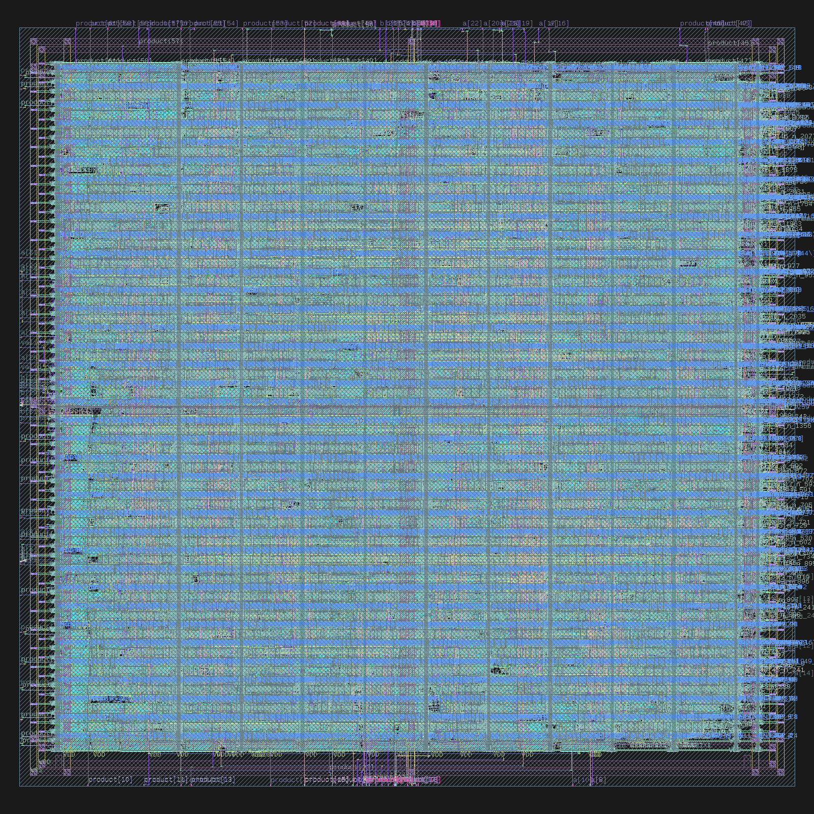

# Cadence RTL-to-GDSII ASIC Design Flow: 32-Bit Pipelined Multiplier

This repository documents the end-to-end **RTL-to-GDSII ASIC Design Flow** of a **32-Bit Pipelined Multiplier**, alongside minor training designs (Multiplexers, FSMs, counters, and FPGA projects) completed during the internship. 

The primary design is a high-performance **3-Stage Pipelined 32-bit Multiplier** implemented in Verilog, synthesized using **Cadence Genus**, and physically implemented (Placed & Routed) using **Cadence Innovus** targeting the **GPDK 90nm (Generic Process Design Kit)** technology node.

---

## 🚀 Design Architecture: 3-Stage Pipelined Multiplier

To meet the 250 MHz target clock frequency on a 90nm node, the multiplication process is decomposed using a byte-by-byte partial product generation scheme to avoid long combinational delay paths.

### 📐 Mathematical Decomposition
Let $a$ and $b$ be 32-bit unsigned integers. We decompose the multiplier $a$ into four 8-bit bytes:
$$a = \{a_{3}, a_{2}, a_{1}, a_{0}\} = a[31:24]\cdot 2^{24} + a[23:16]\cdot 2^{16} + a[15:8]\cdot 2^{8} + a[7:0]$$

Thus, the product $a \times b$ is computed as:
$$a \times b = (a_{0} \times b) + (a_{1} \times b) \cdot 2^{8} + (a_{2} \times b) \cdot 2^{16} + (a_{3} \times b) \cdot 2^{24}$$

### 🎛️ Pipeline Stages
The implementation is pipelined into **3 stages** to maximize throughput (1 result/cycle) and minimize critical path delay:

1. **Stage 1 (Partial Products)**:
   - Computes four 40-bit partial products in parallel:
     - $pp_{0} = a[7:0] \times b$
     - $pp_{1} = a[15:8] \times b$
     - $pp_{2} = a[23:16] \times b$
     - $pp_{3} = a[31:24] \times b$
   - Registered Outputs: `pp0_s1`, `pp1_s1`, `pp2_s1`, `pp3_s1`.
2. **Stage 2 (Pairwise Summation)**:
   - To avoid a slow 4-input addition, Stage 2 performs two parallel 2-input additions:
     - $psum_{lo} = pp_{0} + (pp_{1} \ll 8)$  (covers lower 16-bits of $a \times b$)
     - $psum_{hi} = pp_{2} + (pp_{3} \ll 8)$  (covers upper 16-bits of $a \times b$)
   - Registered Outputs: `psum_lo_s2`, `psum_hi_s2` (both 49 bits max).
3. **Stage 3 (Final Accumulation)**:
   - Computes the final 64-bit product by accumulating the shifted partial sums:
     - $product = psum_{lo} + (psum_{hi} \ll 16)$
   - Registered Outputs: `product` (64-bit) and `valid_out`.

### ⏱️ Performance & Latency
- **Latency**: 3 clock cycles.
- **Throughput**: 1 result per cycle.
- **Clock Period**: 4.0 ns (250 MHz target frequency).

---

## 📂 Repository Structure

The project files are structured as follows:

```
├── mul32_pipeline_final.gds       # Final GDSII physical layout stream-out
├── multiplier_final_signoff.enc   # Innovus signoff design configuration file
├── multiplier_final_signoff.enc.dat/ # Innovus signoff layout database
├── multiplier_final_tapeout.enc   # Innovus final tapeout configuration file
├── multiplier_final_tapeout.enc.dat/ # Innovus final tapeout layout database
├── mul32_pipeline.drc.rpt         # Final Signoff Design Rule Check (DRC) report
├── mul32_pipeline.geom.rpt        # Final Signoff Geometry verification report
├── mul32_pipeline.conn.rpt        # Final Signoff Connectivity verification report
│
├── synthesis/
│   ├── Multiplier/
│   │   ├── mul32pipe.v            # RTL Verilog source code for Pipelined Multiplier
│   │   ├── mul32pipe_tb.v         # Self-checking testbench for Pipelined Multiplier
│   │   ├── constraint.sdc         # Input timing constraints file (4.0ns clk)
│   │   ├── scripts.tcl            # Genus synthesis run script
│   │   ├── output_constraints.sdc # Output constraints generated after synthesis
│   │   ├── multiplier_netlist.v   # Synthesized gate-level netlist
│   │   ├── multiplier_area.rpt    # Synthesis Area report
│   │   ├── multiplier_gates.rpt   # Synthesis Gate count and cell breakdown report
│   │   ├── multiplier_power.rpt   # Synthesis Power report
│   │   └── multiplier_timing.rpt  # Synthesis Setup timing report
│   │
│   └── Counter/                   # Day 4 Counter synthesis training project
│       ├── counter.v              # RTL 8-bit Counter source
│       ├── counter_tb.v           # Testbench for Counter
│       ├── constraint.sdc         # Timing constraints for Counter
│       ├── scripts.tcl            # Genus synthesis run script
│       └── counter_*.rpt          # Area, Power, Timing, Gates reports for Counter
│
├── floorplanning/
│   ├── Default.view               # Multi-Mode Multi-Corner (MMMC) view definition file
│   ├── mul32_pipeline.globals     # Innovus global design import configuration
│   ├── ccopt.spec                 # Clock tree synthesis specification file
│   ├── multiplier_fp.enc / .dat   # Floorplanned layout configuration & database
│   ├── mul32_pipeline.drc.rpt     # Intermediate DRC verification report
│   ├── mul32_pipeline.geom.rpt    # Intermediate Geometry verification report
│   ├── mul32_pipeline_netlist_Implem.v # Post-route implementation gate-level netlist
│   └── timingReports/             # Intermediate P&R timing check reports
│
├── timingReports/                 # Final Post-Route signoff timing reports
│   ├── mul32_pipeline_postRoute_all.tarpt.gz      # Setup timing report
│   ├── mul32_pipeline_postRoute_all_hold.tarpt.gz # Hold timing report
│   └── mul32_pipeline_postRoute.summary.gz        # Timing violation summary
│
└── simulation/                    # Simulation lab files (Day 1 - Day 3)
    ├── Day_1/                     # 2-to-1 Multiplexer RTL, Testbench, and simulator logs
    ├── Day_2/                     # Full Adder, FSMs, and Parameterized Shift-and-Add Multiplier
    └── Day_3/                     # Vivado FPGA Projects (Booth, Pipelined, and Vedic Multipliers)
```

---

## 📊 Synthesis Results (Genus)

The RTL was synthesized using **Cadence Genus** under the GPDK 90nm slow library corner:
- **Target Clock Period**: 4.0 ns (250 MHz)
- **Worst-case Setup Slack**: **+1.0 ps (MET)**
- **Total Cell Area**: **30,516.69 $\mu m^2$**
- **Total Cell Count**: **4,354**
- **Power Dissipation**:
  - Leakage Power: $127.39\ \mu W$ (1.99%)
  - Internal Power: $4.77\ mW$ (74.35%)
  - Switching Power: $1.52\ mW$ (23.67%)
  - **Total Power**: **6.42 mW**

### Gate Count / Cell Type Breakdown
- **Sequential Cells**: 324 (Area: 6,622.87 $\mu m^2$, 21.7% of design)
- **Inverter Cells**: 375 (Area: 978.67 $\mu m^2$, 3.2% of design)
- **Combinational Logic Cells**: 3,655 (Area: 22,915.14 $\mu m^2$, 75.1% of design)

---

## 🎨 Physical Design (Innovus Place & Route)

Physical implementation was performed in **Cadence Innovus** using Multi-Mode Multi-Corner (MMMC) timing libraries (`slow.lib` for setup, `fast.lib` for hold) and a 9-layer metal CapTable.

### P&R Flow Steps
1. **Design Import**: Loaded the synthesized netlist (`multiplier_netlist.v`), constraints (`output_constraints.sdc`), view definitions (`Default.view`), and technology LEF (`gsclib090_translated_ref.lef`).
2. **Floorplanning**: Defined die boundaries and core utilization (~70%). Ports were placed and spaced.
3. **Power Planning (Power Grid)**:
   - Created Power Rings for VDD and VSS nets.
   - Built Power Stripes to distribute power evenly across the standard cell rows.
   - Ran `specialRoute` (sroute) to connect standard cell VDD/VSS rails to power rings.
4. **Placement**: Placed standard cells while optimizing for timing and congestion.
5. **Clock Tree Synthesis (CTS)**: Synthesized a balanced clock tree using the Innovus CCOpt engine to minimize clock skew and delay.
6. **Detailed Routing**: Utilized NanoRoute to perform global and detailed routing across the metal stack (Metal1 to Metal9).
7. **Physical Verification**: Verified DRC, geometry, and connectivity to ensure signoff compliance.
8. **Stream Out**: Exported the final layouts as a GDSII file (`mul32_pipeline_final.gds`) for manufacturing.

### 🖼️ Physical Layout Visualization
Below is the rendered layout of the 32-Bit Pipelined Multiplier generated from the final signoff GDSII stream-out (`mul32_pipeline_final.gds`):

<p align="center">
  
</p>

---

## 📋 ASIC Implementation Summary (TinyTapeout Style)

Here is a summary of the physical implementation metrics and signoff validation results, structured similarly to a **TinyTapeout** run page.

### 📐 Routing & Placement Stats
| Parameter | Value |
|:---|:---|
| **Placement Density (Utilization)** | 86.58% (std cells only) / 87.19% (including fixed cells) |
| **Total Wire Length** | 84,493 $\mu m$ (84.49 mm) |

#### Layer-by-Layer Routing Breakdown
| Layer | Wire Length ($\mu m$) | Percentage |
|:---|:---|:---|
| **Metal1** | 2,031 $\mu m$ | 2.40% |
| **Metal2** | 31,485 $\mu m$ | 37.26% |
| **Metal3** | 32,595 $\mu m$ | 38.58% |
| **Metal4** | 13,154 $\mu m$ | 15.57% |
| **Metal5** | 5,086 $\mu m$ | 6.02% |
| **Metal6** | 141 $\mu m$ | 0.17% |
| **Metal7** | 1 $\mu m$ | < 0.01% |
| **Metal8** | 0 $\mu m$ | 0.00% |
| **Metal9** | 0 $\mu m$ | 0.00% |

### 🎛️ Cell Usage by Category
| Category | Cells / Gate Type Examples | Count |
|:---|:---|:---|
| **Sequential** | Flip-Flops (DFFRHQX1, DFFRX1) | 324 |
| **Inverters** | CLKINVX1-8, INVX1-12, INVXL | 375 |
| **Basic Adders** | Half Adders, Full Adders (ADDFX1, ADDFXL, ADDHXL) | 395 |
| **NAND / NOR** | NAND2, NAND3, NAND4, NOR2, NOR3, NOR4 | 1,180 |
| **AOI / OAI** | AOI21, AOI22, OAI21, OAI22, etc. | 1,595 |
| **AND / OR / Mux / Other** | AND2, AND4, OR2, MXI2XL, etc. | 485 |
| **Logical Cells** | Total cells from RTL synthesis | **4,354** |
| **Physical Cells** | Decap, Tap cells, Fill cells, Tie cells added during P&R | **2,442** |
| **Placed Cells** | **Total placed instances inside the core** | **6,796** |

### 🏁 Signoff Verification Results (Precheck)
| Check | Tool / Scope | Result |
|:---|:---|:---|
| **Design Rule Check (DRC)** | Cadence Innovus `verify_drc` |  Passed (Clean metal/via spacing) |
| **Geometry Check** | Cadence Innovus `verify_geometry` |  Passed (No overlap/boundary violations) |
| **Connectivity Check** | Cadence Innovus `verify_connectivity` |  Passed (All signal & power nets fully connected) |
| **Setup Timing (Worst Case)** | Genus / Innovus MMMC Setup (slow.lib) |  Passed (Slack: +1.0 ps at 250 MHz) |
| **Hold Timing (Best Case)** | Innovus MMMC Hold (fast.lib) |  Passed (Slack: MET) |
| **Logical Equivalence (LVS)** | Cadence LEC (Logical Equivalence Checker) |  Passed (Netlist matches RTL) |
| **Verilog Syntax Check** | Genus compilation |  Passed (No syntax/lint errors) |

---

## 🛠️ How to Run the Tool Flow

### 1. Verification & Simulation (Cadence Xcelium/NC-Verilog)
To run the RTL simulation using Cadence NC-Verilog/Xrun:
```bash
cd synthesis/Multiplier
xrun mul32pipe.v mul32pipe_tb.v +access+r
```

### 2. Synthesis (Cadence Genus)
To run synthesis and generate reports/netlist:
```bash
cd synthesis/Multiplier
genus -files scripts.tcl
```

### 3. Physical Design (Cadence Innovus)
To launch Innovus and import the design:
```bash
cd floorplanning
innovus
# Inside the Innovus command prompt:
source innovus.cmd
```

---

## 📝 Training and Secondary Projects
This repository also contains early training designs:
* **Day 1**: Verification of a basic 2-to-1 Multiplexer.
* **Day 2**: Implementations of:
  - 1-bit Full Adder (`fa.v`).
  - Mealy and Moore FSMs for sequence detection.
  - Parameterized Shift-and-Add Sequential Multiplier (`multiplier.v`).
* **Day 3**: Vivado projects implementing:
  - Booth's Multiplier.
  - Vedic Multiplier.
  - Pipelined Multiplier (for FPGA targeting).
* **Day 4**: Design and synthesis of an 8-bit Up/Down Counter.

---
*Created by [Ad1thh](https://github.com/Ad1thh) as part of the **ASIC & FPGA SoC Design Internship, CUSAT**.*
